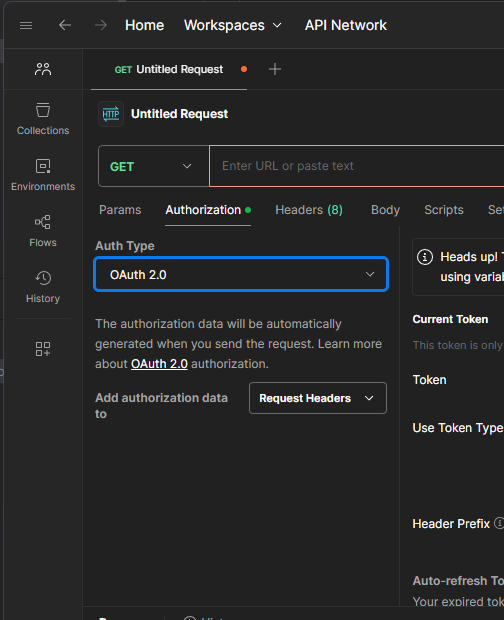
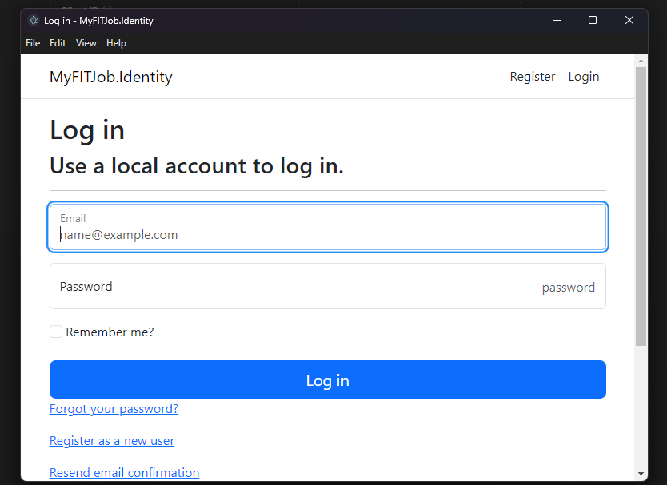
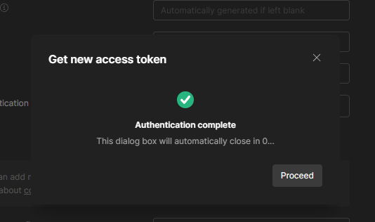
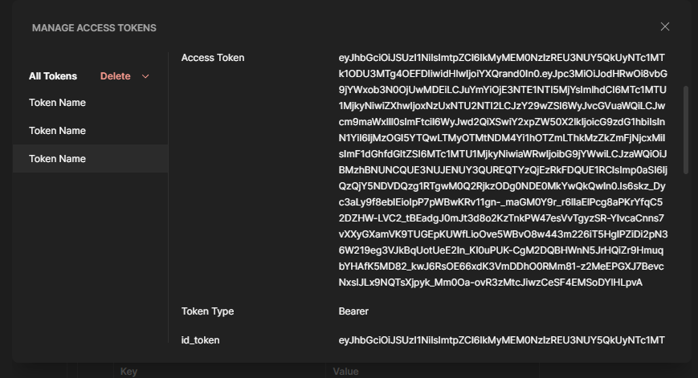
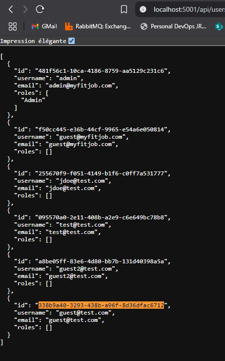
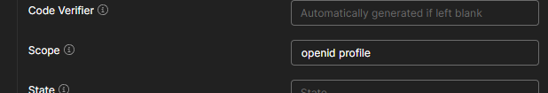
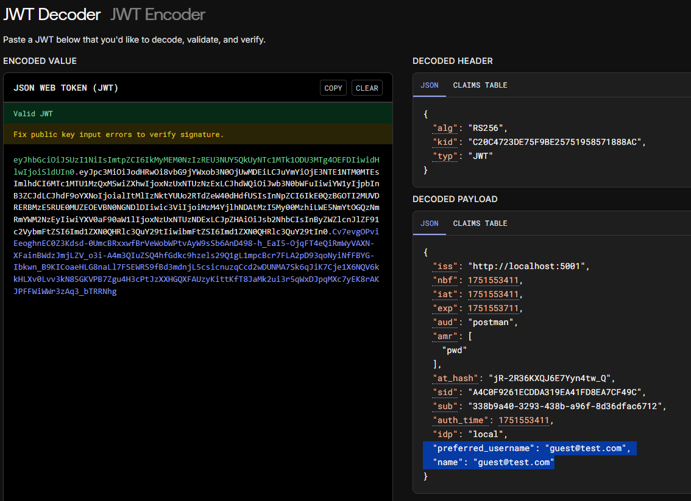

# MyFITJob.Identity - Serveur d'Authentification OIDC

## 🚀 Démarrage rapide

### 1. Démarrer MongoDB  (ne rien faire si la base tourne déjà)
```bash
# Depuis la racine du projet MyFITJob
docker compose up mongodb -d
```

### 2. Démarrer l'API Identity

```bash
# Depuis la racine du projet
docker compose up identity -d
```

L'API sera accessible sur : `http://localhost:5001`

### 3. Tester le serveur OIDC

1. Se connecter sur `http://localhost:5001/.well-known/openid-configuration`

- A quoi correspondent ces informations ? (c'est un *Discovery Document*)
- Notamment la propriété `scope`

2. Télécharger / Utiliser [Postman](https://learning.postman.com/) : `snap install postman` (ou tout autre client )

3. Créer un utilisateur via l'interface: `http://localhost:5001/Identity/Account/Register`, et noter son email et son mot de passe 
ex: guest@test.com | Guest123#  
Vous devez être redirigé vers une 404 -> je n'ai pas activé tout le module d'auth. Mais le compte est normalement créé en base : 
vous pouvez le valider via le endpoint rest: http://localhost:5001/api/users

3. Dans une nouvelle requête, dans l'onglet Authorization, selectionner dans la liste déroulante: "OAuth2" : 


4. Remplir le formulaire pour effectuer l'appel OAuth2 : (les valeurs sont fournies par le *discovery document*)

- Grant Type: "Authorization Code (With PKCE)"
- Auth URL : http://localhost:5001/connect/authorize 
- Access Token URL : http://localhost:5001/connect/token
- clientId: postman // Cette valeur est paramétrée au niveau des appsettings.json de l'Identity Server

Cliquer sur "Get New Access Token"
- Saisir les identifiant/mdp du compte créé à l'étape 3. 



- Normalement, vous devriez être rediriger vers cet écran :


- Puis après le délai ou en cliquant sur suivant, vous avez accès au token retourné par l'Identity Server: 



- Descendre dans la fenêtre pour copier l'id_token (nouveau token fournis par OIDC), et le coller dans https://jwt.io 

Vous devriez observer le Claim "sub" qui contient l'identifiant de votre utilisateur créé  : 


- Enfin, ajouter un scope "profile" dans la liste des scopes demandés : 


Et demander à nouveau un token : vous devriez avoir accès à de nouvelles propriétés dans le token généré: 


> Checkpoint

