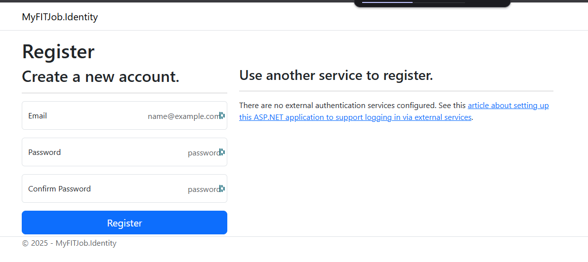

# MyFITJob.Identity - Serveur d'Authentification JWT

## 🚀 Démarrage rapide

### 1. Démarrer MongoDB
```bash
# Depuis la racine du projet MyFITJob
docker compose up mongodb -d
```

### 2. Démarrer l'API Identity

#### Option A (conseillé): Avec Docker Compose 
```bash
# Depuis la racine du projet
docker compose up identity -d
```
L'API sera accessible sur : `http://localhost:5001`

### 3. Tester l'authentification

> Un utilisateur "admin" est créé au démarrage, lors de la création de la collection `identitydb` dans la base MongoDB

Utilisez le fichier `test-identity.http`, ou l'interface OpenAPI (générée par Scalar) : http://localhost:5001/scalar pour tester l'authentification JWT, .

**Identifiants par défaut :**
- **Username** : `admin`
- **Password** : `admin123`

- Décoder ce token `access_token` via un outil web de décodage (ex: https://jwt.io/) 

- Noter les Claims du token, et pour chaque claims, à quoi elle servent

> Checkpoint 

## 4. Créer un nouvel utilisateur 

- Utiliser l'interface `http://localhost:5001/Identity/Account/Register`



- Créez un compte de test grace au endpoint de création d'utilisateur 
*Ex: guest@test.com/Test1234*

- Utiliser la solution de discovery Scalar pour accéder à l'api : `http://localhost:5001/scalar` 
- Valider la création de l'utilisateur via le /GET 
- Récupérer un token pour cet utilisateur et le décoder dans `jwt.io`

## 🔧 Configuration

Les paramètres JWT sont dans `appsettings.json` :
- **SecretKey** : Clé de signature (que l'on peut utiliser pour valider le token coté JWT.io)
- **Issuer** : MyFITJob.Identity
- **Audience** : MyFITJob.API
- **Expiration** : 60 minutes